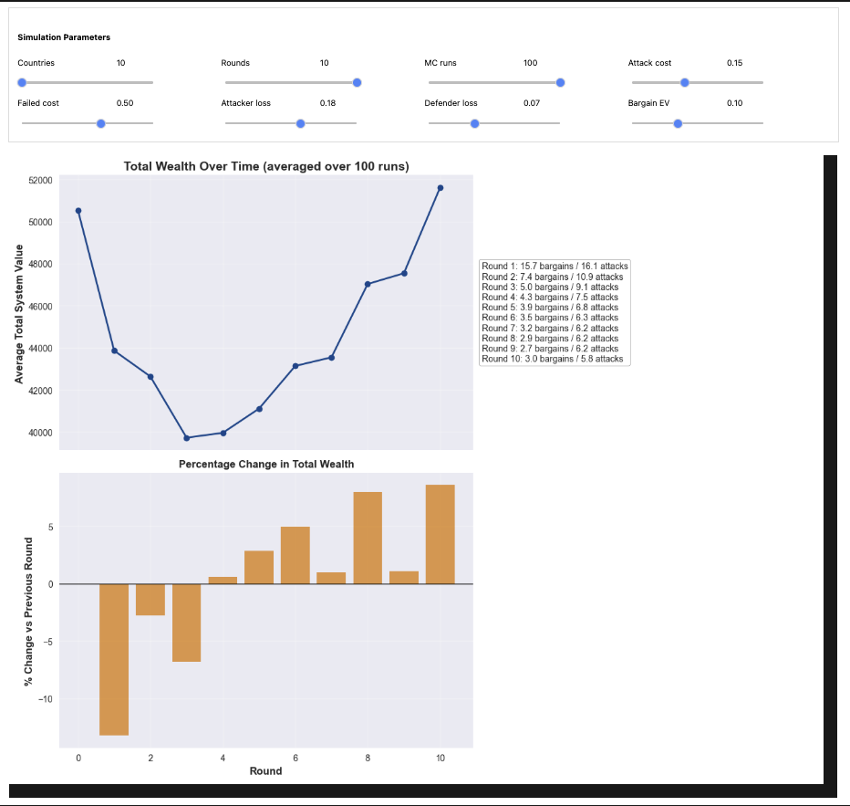

# DietrichGCS Deterrence Modeling

A text-based simulation demonstrating the concept of deterrence through a bargaining model where countries can choose to attack or bargain with each other. Built for the 66-146 Dietrich Grand Challenge Seminar on Complex Social Systems. Developed with the assistance of Claude and Cursor.

## Overview

This simulation models international relations through a game-theoretic framework where countries interact in a round-robin format. Each country makes strategic decisions based on expected value calculations, choosing between peaceful bargaining and strategic attacks.

## Model Details

### Initial Setup
- **100 countries** participate in the simulation (configurable via `NUM_COUNTRIES`)
- Each country starts with a **random private value between 10 and 10000** (configurable via `INITIAL_VALUE_MIN` and `INITIAL_VALUE_MAX`)
- Each country has **perceived values** for all other countries (within 15% of the true private value, configurable via `PERCEIVED_VALUE_ACCURACY`)
- At the start of each round, each active country grows by a **random amount between 1% and 8%** (configurable via `GROWTH_RATE_MIN` and `GROWTH_RATE_MAX`)

### Game Mechanics

#### Actions
Each country can choose one of two actions when interacting with another country:
- **Attack**: Attempt to conquer the other country (based on expected value)
- **Bargain**: Negotiate peacefully for mutual benefit

#### Decision Making
Countries use **expected value calculations** to decide whether to attack:
- Countries compare their perceived EV of attack vs. perceived EV of bargain
- Countries attack if: **perceived EV of attack > perceived EV of bargain**
- This creates a balanced mix of attacks and bargains based on economic rationality

#### Attack Mechanics

**Win Probability**: Based on relative strength (attacker_value / total_value), perceived with ±15% accuracy

- **Success cost**: Base 15% of total value, discounted if attacker is much larger (up to 50% discount for overwhelming strength)
- **Failed cost**: Base 50% of the attacker's value, scaled by the defender's share (attacking a tiny country can halve the penalty; attacking a larger peer can push it up to ~75%)
- **Perceived costs**: Countries estimate costs with ±15% accuracy (creates decision uncertainty)

**Attack Outcomes**:
- **Success**: Attacker gains defender's value (capped at 2× attacker's value), pays 15% cost, defender eliminated
- **Failure**: Attacker pays the scaled failed-cost penalty, defender still only loses 5% of value

**Protection Rule**: Smaller countries cannot gain more than 2× their value (prevents total takeover)

#### Bargain Mechanics
- Total surplus of **20%** is randomly split between the two countries (configurable via `BARGAIN_SURPLUS_PERCENTAGE`)
- One country gets a random percentage between 0% and 20% of their private value
- The other country gets the remainder (20% - first country's percentage)
- Expected value of bargain is **10%** (average of 0-20%, configurable via `BARGAIN_EV_PERCENTAGE`)
- No risk of loss

#### Information Updates
After each interaction, all other countries' perceived values of the interacting countries are re-rated within 15% of the true value.

### Round Structure

The simulation runs **one complete round** in round-robin format:
- Each country interacts with every other active country exactly once
- Total interactions = n × (n-1) / 2 where n is the number of active countries
- At the start of the round, all active countries grow by 1-8% (random growth rate per country)

### Statistics Tracked

For each country, the simulation tracks:
- **Growth Rate**: Random growth percentage (1-8%) applied at the start of the round
- **Attacks Attempted**: Total number of attacks initiated
- **Attacks Won**: Successful attacks
- **Attacks Lost**: Failed attacks
- **Defended**: Successful defenses
- **Change**: Absolute change in value from previous round
- **Change %**: Percentage change in value from previous round

## Configuration

All simulation parameters are easily adjustable via global variables at the top of `deterrence_simulation.py`:

```python
# Initial Setup
NUM_COUNTRIES = 10
INITIAL_VALUE_MIN = 10
INITIAL_VALUE_MAX = 10000

# Perceived Values
PERCEIVED_VALUE_ACCURACY = 0.15  # 15% accuracy (0.85-1.15 range)

# Growth
GROWTH_RATE_MIN = 0.01  # 1% minimum growth per round
GROWTH_RATE_MAX = 0.08  # 8% maximum growth per round

# Attack Mechanics
ATTACK_COST_PERCENTAGE = 0.15  # Base success cost before discounts
FAILED_ATTACK_COST_PERCENTAGE = 0.50  # Base failed cost (scaled by defender size)
ATTACK_SUCCESS_DISCOUNT_CAP = 0.50  # Successful attack cost discount cap
DEFENDER_DEFENSE_LOSS_PERCENTAGE = 0.05  # Defender loss when defense succeeds
MAX_GAIN_MULTIPLIER = 2.0  # Smaller countries capped at 2× their value
PERCEIVED_COST_ACCURACY = 0.15  # Perceived costs ±15% of true costs

# Bargain Mechanics
BARGAIN_SURPLUS_PERCENTAGE = 0.30  # 30% total surplus (0-30% split)
BARGAIN_EV_PERCENTAGE = 0.10  # 10% expected value (average of 0-20%)
```

## Usage

### Running a Single Simulation

```bash
python deterrence_simulation.py
```

This runs a single simulation with one complete round-robin round and displays detailed output.

### Running Statistical Analysis

```bash
python analyze_simulation.py
```

This runs the simulation multiple times (default: 100 runs) and calculates statistical means, min, max, and standard deviations for Round 1. The analysis script:

- Runs the simulation silently (suppresses output)
- Collects statistics from each run
- Calculates statistical measures (mean, min, max, standard deviation)
- Displays comprehensive analysis results

You can adjust the number of runs by modifying `NUM_RUNS` in `analyze_simulation.py` (default: 100).

**Analysis Output Includes:**
- **Value Statistics**: Initial, start, end, change, and percentage change
- **Country Statistics**: Initial count, start/end counts, eliminated, average growth rate
- **Interaction Statistics**: Total interactions, bargains, attacks (successful/failed)
- **Aggregate Attack Statistics**: Attempted, won, lost, defended across all countries
- **Attack Success Rate**: Percentage of successful attacks

### Running Visualizations

```bash
python visualize_deterrence.py
```

This creates comprehensive visualizations of deterrence dynamics (nuclear weapons are not yet modeled—those will be layered on later). The visualization script:

- Runs a simulation (default: 1 round, matching main simulation)
- Generates 7 visualizations that highlight how bargaining and deterrence prevent costly wars
- Saves all plots to the `visualizations/` directory

**Command-line options:**
```bash
# Default: 1 round (matches main simulation)
python visualize_deterrence.py

# Run multiple rounds to see trends
python visualize_deterrence.py --rounds 5

# Custom seed and output directory
python visualize_deterrence.py --rounds 10 --seed 123 --output-dir my_plots

# See all options
python visualize_deterrence.py --help
```

**Visualizations Generated:**
1. **Attack Rate vs Bargain Rate** - Shows deterrence effectiveness over time
1b. **Value Saved by Bargains** - Estimates value preserved because countries chose to bargain instead of fight
2. **Perceived vs Actual EV** - Shows how misperception affects decisions
3. **Country Survival** - Tracks system stability
4. **Total Value Over Time** - Shows value preservation
5. **Attack Success Rate** - Shows defense effectiveness
6. **EV Comparison** - Shows why countries choose attack vs bargain

See `VISUALIZATION_GUIDE.md` for detailed explanations of each visualization and how to interpret them.

### Interactive Sandbox



Launch `interactive_deterrence.ipynb` in Jupyter/VS Code to experiment with:
- Sliders for attack costs, failed costs (with defender-scaling), defender loss, bargaining EV, country count, rounds, and Monte Carlo runs
- Total wealth + percentage-change plots that update automatically as you release sliders
- Real-time averages (over configurable MC runs) to explore how parameter tweaks change the balance between deterrence and bargaining

### Output

The simulation displays:

1. **Initial State**: Shows all countries with their starting private values and total value

2. **Round Information**: 
   - Total value at the start of the round (after growth)
   - Change from previous round (if applicable)

3. **Round Results**: Detailed results of each interaction showing:
   - Initial private values for each country
   - Perceived values of each other
   - Perceived and actual expected values (EV) of attack
   - Perceived and actual win probabilities
   - Chosen action (attack or bargain)
   - If attack: who attacks whom, true % chance of winning, and outcome
   - Value changes for each country

4. **Final Status Table**: For each country shows:
   - Private value
   - Status (Active/Removed)
   - Growth rate for the round
   - Attacks attempted, won, lost, and defended
   - Change in value from previous round (absolute and percentage)

5. **Round Statistics**:
   - Percentage change in total value since the beginning of the round
   - Number of bargains made
   - Number of attacks made
   - Total number of interactions
   - Countries at start of round
   - Countries at end of round

### Example Output

```
Deterrence Modeling Simulation
============================================================

Initial State:
Total Value: 54353.92

Round 1
============================================================
Total Value: 44480.09
Change from previous round: N/A (initial round)
============================================================

Round 1 Results
============================================================
Country 1 vs Country 2
  Initial Values: C1=6397.87, C2=259.86
  Perceived Values: C1 perceives C2=242.32, C2 perceives C1=6397.87
  Expected Values (Attack):
    C1: Perceived EV=882.39, Actual EV=81.01, Bargain EV=639.79 → Chooses: attack
    C2: Perceived EV=966.37, Actual EV=745.85, Bargain EV=25.99 → Chooses: attack
  Win Probabilities:
    C1: Perceived=21.07%, Actual=18.53%
    C2: Perceived=90.76%, Actual=81.47%
  → Country 1 attacked Country 2
  → Actual odds of success: 18.53%
  → Attack FAILED (defense successful)
  → Country 1 value: 5758.08
  → Country 2 value: 233.87

...

Round 1
============================================================
Country    Private Value   Status     Growth Rate  Attacks Attempted  Attacks Won  Attacks Lost  Defended   Change     Change %  
----------------------------------------------------------------------------------------------------------------------------------
1          9186.93         Active     2.49%        0                  0            0             0          +1267.36   +16.00%   
2          3886.58         Active     7.86%        0                  0            0             1          +104.62    +2.77%    
...

Round 1 Statistics
============================================================
Percentage change in total value: -6.65%
Number of bargains: 27
Number of attacks: 8
Total interactions: 35
Countries at start of round: 10
Countries at end of round: 5
============================================================
```

## Requirements

### Core Simulation
- Python 3.7+
- No external dependencies (uses only standard library)

### Visualization Script
The visualization script requires additional packages. Install them with:

```bash
pip install -r requirements.txt
```

Or install individually:
```bash
pip install matplotlib seaborn numpy
```

**Required packages for visualization:**
- `matplotlib>=3.5.0` - For creating plots
- `seaborn>=0.12.0` - For enhanced styling
- `numpy>=1.21.0` - For numerical operations

## How It Works

1. **Initialization**: Countries are created with random private values and perceived values for all other countries

2. **Round Start**: 
   - Previous values are stored for comparison
   - All active countries grow by a random amount (1-8%)
   - Growth rates are tracked for each country
   - Total value is calculated and displayed

3. **Interactions**: 
   - Countries are paired in round-robin format
   - Each country decides to attack or bargain based on expected value comparison
   - Interactions are resolved (attacks succeed/fail randomly based on perceived odds, bargains split surplus)
   - Attack statistics are tracked (attempted, won, lost, defended)

4. **Statistics**: 
   - Attack outcomes are tracked
   - Perceived values are updated
   - Final statistics are calculated and displayed
   - Shows countries eliminated during the round

## Key Features

- **Expected Value Decision Making**: Countries attack when perceived EV of attack > perceived EV of bargain
- **Imperfect Information**: Countries have perceived values and odds that may differ from reality (within 15%)
- **Asymmetric Attack Costs**: 
  - Success: 15% of total value, discounted when attacker is much larger
  - Failure: 50% of attacker's value (failed cost only), defender loses only 5%
- **Perceived Costs**: Countries estimate costs with ±15% accuracy (creates decision uncertainty)
- **Size Advantage**: Bigger countries have much higher actual EV when attacking smaller ones
- **Smaller Country Protection**: Smaller countries are capped at 2x their value (no total takeover)
- **Random Growth**: Each country grows by a random amount (1-8%) each round
- **Comprehensive Statistics**: Detailed tracking of all interactions, outcomes, and country survival
- **Configurable Parameters**: All key parameters are easily adjustable at the top of the file
- **Statistical Analysis Tool**: Run multiple simulations and get statistical means, distributions, and success rates
- **Visualization Suite**: Comprehensive visualizations to understand deterrence dynamics

## Analysis Tools

### Statistical Analysis

The `analyze_simulation.py` script provides statistical analysis by running the simulation multiple times and aggregating results. This is useful for:

- Understanding average outcomes across many runs
- Identifying patterns and distributions
- Testing how parameter changes affect overall behavior
- Getting reliable statistics on attack success rates, country survival, value changes, etc.

### Visualization

The `visualize_deterrence.py` script creates comprehensive visualizations to understand deterrence dynamics. This is useful for:

- Visualizing deterrence effectiveness over time
- Understanding how perception vs reality affects decisions
- Tracking system stability and value preservation
- Identifying patterns in attack vs bargain choices
- Comparing expected values across different scenarios

See `VISUALIZATION_GUIDE.md` for detailed explanations of each visualization and interpretation guidelines.

**Example Analysis Output:**
```
DETERRENCE SIMULATION ANALYSIS - 100 RUNS
================================================================================

VALUE STATISTICS
--------------------------------------------------------------------------------
Initial Total Value:
  Mean: 49084.15 | Min: 24086.49 | Max: 74683.49 | Std Dev: 10250.01
Percentage Change:
  Mean: -31.50% | Min: -88.66% | Max: +55.68% | Std Dev: 28.35%

COUNTRY STATISTICS
--------------------------------------------------------------------------------
Countries at End of Round:
  Mean: 7.07 | Min: 4 | Max: 10 | Std Dev: 1.29
Countries Eliminated:
  Mean: 2.93 | Min: 0 | Max: 6 | Std Dev: 1.29

INTERACTION STATISTICS
--------------------------------------------------------------------------------
Bargains:
  Mean: 14.91 | Min: 4 | Max: 32 | Std Dev: 6.12
Total Attacks:
  Mean: 18.02 | Min: 6 | Max: 29 | Std Dev: 4.72
Successful Attacks:
  Mean: 2.93 | Min: 0 | Max: 6 | Std Dev: 1.29

Attack Success Rate: 16.26%
```

## Files

- **`deterrence_simulation.py`** - Main simulation code
- **`analyze_simulation.py`** - Statistical analysis tool (runs multiple simulations)
- **`visualize_deterrence.py`** - Visualization tool (creates plots and charts)
- **`requirements.txt`** - Python package dependencies for visualization
- **`VISUALIZATION_GUIDE.md`** - Detailed guide to understanding the visualizations
- **`README.md`** - This file

## Recent Updates

### Attack Cost Mechanics (Latest)
- **Success cost**: 15% of total value (discounted up to 50% when attacker is much larger)
- **Failure cost**: 50% of attacker's value (defender loses 5%)
- **Perceived costs**: ±15% accuracy for cost estimates (creates uncertainty)
- **True vs Perceived EV**: Calculations properly account for perceived vs actual costs

### Visualization Suite (New)
- Added comprehensive visualization script with 6 different plot types
- Created visualization guide with interpretation instructions
- Added command-line interface for flexible configuration
- Supports multiple rounds for trend analysis

### Dependencies
- Added `requirements.txt` for easy package installation
- Visualization script handles missing dependencies gracefully
